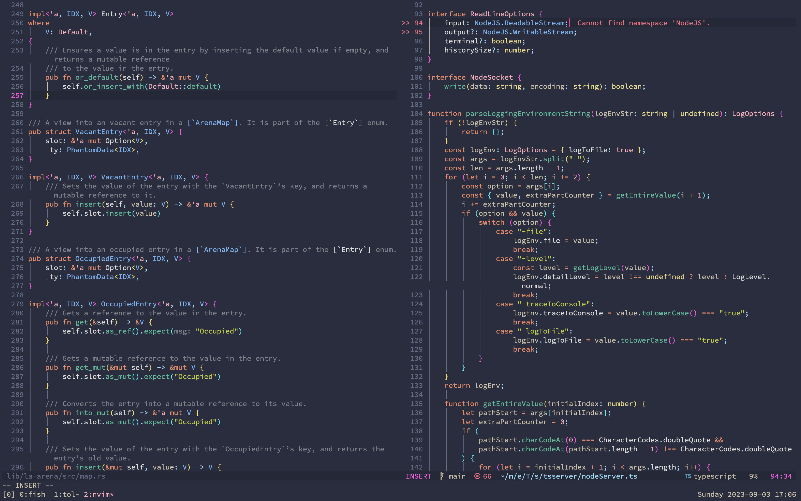

# Tol.nvim

This is a Neovim port of my [Tol theme for VS Code](https://github.com/dustypomerleau/tol).
As always, credit to [Paul Tol](https://personal.sron.nl/~pault/) for the base colors and inspiration.

The theme is in early beta—more plugin support soon.

[Rainbow delimiters][] and [Lualine][] are used in the screenshot.



## Supported plugins

- [CoC][]
- [Cmp][]
- [FZF Lua][]
- [Flash][]
- [Gitsigns][]
- [Indent Blankline][]
- [Leap][]
- [LSP Diagnostics][]
- [Lualine][]
- [Notify][]
- [Rainbow Delimiters][]
- [Telescope][]
- [Treesitter][]
- [Trouble][]
- [Yanky][]

## Installation

```vim
" vim-plug
call plug#begin()
    Plug 'dustypomerleau/tol.nvim'
call plug#end()

colorscheme tol
```

```lua
-- lazy.nvim
require("lazy").setup({
    {
        "dustypomerleau/tol.nvim",
        lazy = false, -- load your main colorscheme at startup
        priority = 1000, -- load colorscheme first
        config = true,
    },
})
```

## Extras

Enable the Lualine theme:

```lua
require("lualine").setup({ options = { theme = "tol" }})
```

Set up Rainbow Delimiters (3 levels are provided):

```lua
local rainbow_delimiters = require("rainbow-delimiters")

vim.g.rainbow_delimiters = {
    strategy = { [""] = rainbow_delimiters.strategy["global"] },
    query = { [""] = "rainbow-delimiters" },
    highlight = {
        "RainbowDelimiterRed",
        "RainbowDelimiterYellow",
        "RainbowDelimiterBlue",
    }
}
```

[CoC]: https://github.com/neoclide/coc.nvim
[Cmp]: https://github.com/hrsh7th/nvim-cmp 
[Flash]: https://github.com/folke/flash.nvim
[FZF Lua]: https://github.com/ibhagwan/fzf-lua
[Gitsigns]: https://github.com/lewis6991/gitsigns.nvim
[Indent Blankline]: https://github.com/lukas-reineke/indent-blankline.nvim
[Leap]: https://github.com/ggandor/leap.nvim
[LSP Diagnostics]: https://neovim.io/doc/user/lsp.html
[Lualine]: https://github.com/hoob3rt/lualine.nvim
[Notify]: https://github.com/rcarriga/nvim-notify 
[Rainbow Delimiters]: https://github.com/HiPhish/rainbow-delimiters.nvim
[Telescope]: https://github.com/nvim-telescope/telescope.nvim
[Treesitter]: https://github.com/nvim-treesitter/nvim-treesitter
[Trouble]: https://github.com/folke/trouble.nvim
[Yanky]: https://github.com/gbprod/yanky.nvim
